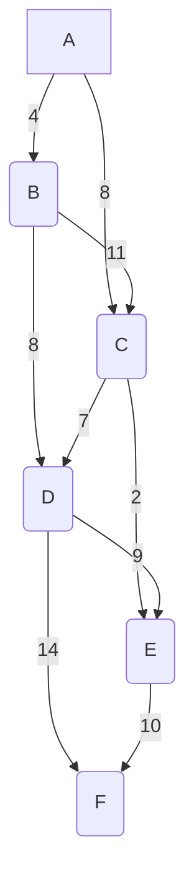

Okay, here's an in-depth tutorial on using Obsidian for Computer Science, including a comprehensive Markdown guide. I've focused on practical examples to help you get started and leverage Obsidian's features effectively.

**Table of Contents**

1. **Introduction to Obsidian**
    *   What is Obsidian?
    *   Why Use Obsidian for Computer Science?
    *   Core Features
    *   Installation
2. **Markdown Basics for Obsidian**
    *   Headings
    *   Text Formatting (Bold, Italic, Strikethrough, etc.)
    *   Lists (Ordered and Unordered)
    *   Links (Internal and External)
    *   Images
    *   Code Blocks
    *   Tables
    *   Blockquotes
    *   Horizontal Rules
    *   Footnotes
    *   Task Lists
    *   Callouts
    *   Mathematical Expressions (LaTeX)
3. **Setting Up Your Obsidian Vault for Computer Science**
    *   Creating a New Vault
    *   Folder Structure
    *   Note-Taking Templates
4. **Essential Obsidian Concepts for Computer Science Students**
    *   Linking Notes: Building Your Knowledge Graph
    *   Tags: Organizing by Topic
    *   Backlinks: Discovering Connections
    *   Graph View: Visualizing Your Notes
    *   Daily Notes: Tracking Progress and Ideas
    *   Canvas: Visual Brainstorming and Organization
5. **Advanced Obsidian Techniques**
    *   Dataview Plugin: Querying Your Notes
    *   Templater Plugin: Automating Note Creation
    *   Custom CSS: Tailoring Obsidian's Appearance
6. **Obsidian for Computer Science: Practical Examples**
    *   Data Structures and Algorithms
    *   Operating Systems
    *   Database Management Systems
    *   Programming Languages
    *   Project Management
    *   Research Papers and Literature Review
    *   Problem Solving with Pseudocode and Diagrams
7. **Tips for Success**
8. **Conclusion**

**1. Introduction to Obsidian**

**What is Obsidian?**

Obsidian is a powerful, free, and locally-stored note-taking application that allows you to create and connect notes using Markdown. It's like a personal wiki for your brain, where you can build a web of interconnected ideas, concepts, and knowledge.

**Why Use Obsidian for Computer Science?**

*   **Structure and Organization:** Computer science is filled with complex, interconnected topics. Obsidian helps you organize your notes in a structured way, making it easier to understand and retain information.
*   **Linking and Relationships:**  The ability to link notes together helps you see the relationships between different concepts (e.g., how a binary tree relates to a hash table).
*   **Code Handling:** Obsidian has excellent support for code blocks with syntax highlighting, making it great for storing code snippets, algorithms, and programming notes.
*   **Customization and Extensibility:** Obsidian's plugin system allows you to customize the app to fit your specific needs, whether it's adding support for LaTeX equations, integrating with Zotero for research, or creating custom workflows.
*   **Offline and Local:** Your notes are stored locally on your computer, so you have full control over your data and can access them even without an internet connection.

**Core Features**

*   **Markdown Editor:** A clean, distraction-free writing environment.
*   **Note Linking:** Create connections between notes using `[[wikilinks]]` or `[markdown links](path/to/note.md)`.
*   **Graph View:** Visualize the relationships between your notes.
*   **Backlinks:** See which notes link to the current note.
*   **Tags:** Categorize and organize notes.
*   **Plugin System:** Extend Obsidian's functionality.

**Installation**

1. Go to the Obsidian website ([https://obsidian.md/](https://obsidian.md/)).
2. Download the installer for your operating system (Windows, macOS, or Linux).
3. Run the installer and follow the on-screen instructions.

**2. Markdown Basics for Obsidian**

Markdown is a lightweight markup language that lets you format plain text using simple symbols. Here's a guide to the Markdown syntax you'll use most often in Obsidian:

**Headings**

```markdown
# Heading 1
## Heading 2
### Heading 3
#### Heading 4
##### Heading 5
###### Heading 6
```

**Text Formatting**

```markdown
*Italic* or _Italic_
**Bold** or __Bold__
***Bold Italic*** or ___Bold Italic___
~~Strikethrough~~
`Inline Code`
==Highlight==
```

**Lists**

**Unordered Lists**

```markdown
- Item 1
- Item 2
  - Subitem 2.1
  - Subitem 2.2
- Item 3
```

**Ordered Lists**

```markdown
1. First item
2. Second item
   1. Subitem 1
   2. Subitem 2
3. Third item
```

**Links**

**Internal Links (to other notes in your vault)**

```markdown
[[Data Structures]] 
[[Algorithms/Sorting Algorithms]] 
```

**External Links**

```markdown
[Obsidian Website](https://obsidian.md/)
```

**Images**

```markdown


```

**Code Blocks**

```python
def binary_search(arr, target):
  """
  Performs a binary search on a sorted array.

  Args:
    arr: The sorted array.
    target: The value to search for.

  Returns:
    The index of the target if found, otherwise -1.
  """
  low = 0
  high = len(arr) - 1

  while low <= high:
    mid = (low + high) // 2
    if arr[mid] == target:
      return mid
    elif arr[mid] < target:
      low = mid + 1
    else:
      high = mid - 1

  return -1

# Example usage:
my_array = [2, 5, 8, 12, 16, 23, 38, 56, 72, 91]
target_value = 23
result_index = binary_search(my_array, target_value)

if result_index != -1:
  print(f"Element {target_value} is present at index {result_index}")
else:
  print(f"Element {target_value} is not present in the array")
```

**Tables**

```markdown
| Header 1 | Header 2 | Header 3 |
| -------- | -------- | -------- |
| Row 1, Cell 1 | Row 1, Cell 2 | Row 1, Cell 3 |
| Row 2, Cell 1 | Row 2, Cell 2 | Row 2, Cell 3 |
```

**Blockquotes**

```markdown
> This is a blockquote.
> It can span multiple lines.
```

**Horizontal Rules**

```markdown
---
***
___
```

**Footnotes**

```markdown
Here is some text with a footnote.[^1]

[^1]: This is the footnote content.
```

**Task Lists**

```markdown
- [ ] Task 1
- [x] Completed Task 2
- [ ] Task 3
```

**Callouts**

```markdown
> [!NOTE]
> This is a note callout.

> [!WARNING]
> This is a warning callout.

> [!IMPORTANT]
> This is an important callout.
```

**Mathematical Expressions (LaTeX)**

Obsidian supports LaTeX for mathematical notation.

```markdown
$$
\sum_{i=1}^{n} i = \frac{n(n+1)}{2} 
$$

$$
E = mc^2
$$

$$
\begin{bmatrix}
a & b \\
c & d
\end{bmatrix}
$$
```

**3. Setting Up Your Obsidian Vault for Computer Science**

**Creating a New Vault**

1. Open Obsidian.
2. Click on "Create new vault."
3. Give your vault a name (e.g., "Computer Science Notes").
4. Choose a location on your computer to store your vault.
5. Click "Create."

**Folder Structure**

A well-organized folder structure is crucial. Here's a suggested structure:

```
Computer Science Notes/
├── Courses/
│   ├── Data Structures and Algorithms/
│   │   ├── Notes/
│   │   │   ├── Binary Trees.md
│   │   │   ├── Hash Tables.md
│   │   │   ├── Quick Sort.md
│   │   │   └── ...
│   │   ├── Assignments/
│   │   └── Exams/
│   ├── Operating Systems/
│   ├── Database Management/
│   └── ...
├── Projects/
│   ├── Project 1/
│   ├── Project 2/
│   └── ...
├── Topics/
│   ├── Programming Languages/
│   │   ├── Python/
│   │   ├── Java/
│   │   └── ...
│   ├── Machine Learning/
│   ├── Artificial Intelligence/
│   └── ...
├── Resources/
│   ├── Cheat Sheets/
│   ├── Useful Links/
│   └── ...
├── Daily Notes/
└── Templates/
```

**Note-Taking Templates**

Templates save you time and ensure consistency. Here's an example of a lecture note template:

```markdown
---
tags: lecture, {{course name}}, {{date}}
---

# {{Course Name}} - {{Topic}}

## Key Concepts

- 
- 
- 

## Notes

## Questions

- 
- 

## Summary

---
## Related
- [[Related Note 1]]
- [[Related Note 2]]
```

**4. Essential Obsidian Concepts for Computer Science Students**

**Linking Notes: Building Your Knowledge Graph**

Linking is the heart of Obsidian. Use `[[wikilinks]]` to connect related notes.

**Example:**

In your "Binary Trees.md" note, you might write:

```markdown
Binary trees are a fundamental data structure. They are often used to implement [[Hash Tables]] and [[Priority Queues]].
```

**Tags: Organizing by Topic**

Use `#tags` to categorize notes.

**Example:**

```markdown
# Data Structures #binary-tree #algorithms
```

**Backlinks: Discovering Connections**

The "Backlinks" pane shows you all the notes that link to the current note. This helps you discover unexpected relationships between concepts.

**Graph View: Visualizing Your Notes**

The Graph View provides a visual representation of your notes and their connections. It's a great way to see the structure of your knowledge and identify areas that need more development.

**Daily Notes: Tracking Progress and Ideas**

Use Daily Notes (you might need to enable the "Daily notes" core plugin) to:

*   Log what you learned each day.
*   Jot down ideas for projects.
*   Track your progress on assignments.
*   Reflect on challenging concepts.

**Example Daily Note:**

```markdown
# 2023-11-20

## Summary of Activities
- Attended lecture on [[Heap Sort]] in [[Data Structures and Algorithms]].
- Started working on [[Assignment 3 - Graph Algorithms]].
- Read Chapter 5 of the Operating Systems textbook.

## Ideas
- Potential project idea: Implement a file system simulator.

## Questions
- How does the worst-case time complexity of Heap Sort remain O(n log n)?

## Tasks
- [ ] Complete coding problem 2 in [[Assignment 3 - Graph Algorithms]].
- [ ] Review [[Virtual Memory]] concepts.
```

**Canvas: Visual Brainstorming and Organization**

Use Canvas files to visually organize and connect notes, media, and web pages. This can be helpful for:
*   Mapping out complex relationships between concepts.
*   Creating visual study guides.
*   Brainstorming project ideas.

**Example Canvas:**

1. Create a new Canvas file (e.g., "Operating System Concepts.canvas").
2. Add relevant notes to the canvas by dragging them from the file explorer.
3. Connect notes with arrows to show relationships.
4. Add text, images, or even embed web pages to provide more context.

**5. Advanced Obsidian Techniques**

**Dataview Plugin: Querying Your Notes**

Dataview lets you treat your notes like a database. You can write queries to display lists of notes based on criteria like tags, folders, or even the content of the notes.

**Example Dataview Queries:**

**List all notes in the "Data Structures and Algorithms" folder:**

```dataview
LIST
FROM "Courses/Data Structures and Algorithms/Notes"
```

**Table of all assignments with their due dates (assuming you have a "due" metadata field in your assignment notes):**

```dataview
TABLE due AS "Due Date"
FROM "Courses/Data Structures and Algorithms/Assignments"
SORT due ASC
```

**List all notes tagged with #algorithms and #sorting:**

```dataview
LIST
FROM #algorithms AND #sorting
```

**Templater Plugin: Automating Note Creation**

Templater allows you to create dynamic templates with variables, JavaScript code, and more.

**Example Templater Template (for a new algorithm note):**

```markdown
---
tags: algorithm, {{tp.file.folder()}}
created: {{tp.file.creation_date()}}
---

# {{tp.file.title}}

## Description

## Time Complexity

## Space Complexity

## Implementation (Python)

```python
# Code goes here
```

## Use Cases

## Related Algorithms
- [[Related Algorithm 1]]
- [[Related Algorithm 2]]
```

**Custom CSS: Tailoring Obsidian's Appearance**

You can customize Obsidian's look and feel by adding custom CSS snippets.

**Example CSS (to change the color of all level 1 headings):**

```css
h1 {
  color: #0077cc;
}
```

**6. Obsidian for Computer Science: Practical Examples**

**Data Structures and Algorithms**

*   **Note:** `Binary Search Tree.md`
*   **Content:**

```markdown
# Binary Search Tree (BST)

## Definition
A binary search tree is a binary tree data structure where:
- The left subtree of a node contains only nodes with keys lesser than the node's key.
- The right subtree of a node contains only nodes with keys greater than the node's key.
- The left and right subtree each must also be a binary search tree.
- There must be no duplicate nodes.

## Operations
- **Insertion:** `O(log n)` on average, `O(n)` in the worst case.
- **Deletion:** `O(log n)` on average, `O(n)` in the worst case.
- **Search:** `O(log n)` on average, `O(n)` in the worst case.
- **Traversal:**
    - **Inorder:** Gives nodes in non-decreasing order.
    - **Preorder:** Used to create a copy of the tree.
    - **Postorder:** Used to delete the tree.

## Implementation (Python)
```python
class Node:
    def __init__(self, key):
        self.key = key
        self.left = None
        self.right = None

def insert(node, key):
    if node is None:
        return Node(key)
    else:
        if key < node.key:
            node.left = insert(node.left, key)
        else:
            node.right = insert(node.right, key)
    return node

def search(node, key):
    if node is None or node.key == key:
        return node

    if key < node.key:
        return search(node.left, key)
    return search(node.right, key)

# Example usage
root = None
root = insert(root, 50)
insert(root, 30)
insert(root, 20)
insert(root, 40)
insert(root, 70)
insert(root, 60)
insert(root, 80)

print("Search for 40:", search(root, 40).key)  # Output: 40
```

## Advantages
- Efficient search, insertion, and deletion operations (on average).
- Ordered traversal is possible.

## Disadvantages
- Worst-case time complexity can be `O(n)` for skewed trees.
- Requires more space compared to arrays.

## Applications
- Implementing maps and sets.
- Symbol tables in compilers.
- Autocompletion and spell-checking.

## Related
- [[Red-Black Tree]]
- [[AVL Tree]]
```

**Operating Systems**

*   **Note:** `Process Synchronization.md`
*   **Content:**

```markdown
# Process Synchronization

## The Critical-Section Problem
- A **critical section** is a code segment that accesses shared data and whose execution should be atomic (indivisible).
- The **critical-section problem** is to design a protocol that processes can use to cooperate.

## Solutions to the Critical-Section Problem
A solution must satisfy:
1. **Mutual Exclusion:** Only one process can be in its critical section at a time.
2. **Progress:** If no process is in its critical section and some processes wish to enter, the selection of the next process to enter cannot be postponed indefinitely.
3. **Bounded Waiting:** There exists a bound on the number of times that other processes are allowed to enter their critical sections after a process has made a request to enter its critical section and before that request is granted.

## Synchronization Hardware
- **TestAndSet Instruction:**

```c
boolean TestAndSet(boolean *target) {
    boolean rv = *target;
    *target = TRUE;
    return rv;
}
```

- **CompareAndSwap Instruction:**

```c
int CompareAndSwap(int *value, int expected, int new_value) {
    int temp = *value;
    if (*value == expected)
        *value = new_value;
    return temp;
}
```

## Semaphores
- A **semaphore** is an integer variable accessed only through two standard atomic operations: `wait()` and `signal()`.
- **wait()**:
```c
wait(S) {
    while S <= 0
        ; // no-op
    S--;
}
```

- **signal()**:
```c
signal(S) {
    S++;
}
```

## Classic Problems of Synchronization
- [[Producer-Consumer Problem]]
- [[Readers-Writers Problem]]
- [[Dining-Philosophers Problem]]

## Monitors
- A high-level abstraction that provides a convenient and effective mechanism for process synchronization.
- Only one process may be active within the monitor at a time.

## Related
- [[Deadlocks]]
- [[Concurrency]]
```

**Database Management Systems**

*   **Note:** `SQL Joins.md`
*   **Content:**

```markdown
# SQL Joins

Joins are used to combine rows from two or more tables based on a related column between them.

## Types of Joins

### INNER JOIN
Returns rows when there is at least one match in both tables.

```sql
SELECT column_name(s)
FROM table1
INNER JOIN table2
ON table1.column_name = table2.column_name;
```

### LEFT (OUTER) JOIN
Returns all rows from the left table (table1), and the matched rows from the right table (table2). The result is NULL from the right side if there is no match.

```sql
SELECT column_name(s)
FROM table1
LEFT JOIN table2
ON table1.column_name = table2.column_name;
```

### RIGHT (OUTER) JOIN
Returns all rows from the right table (table2), and the matched rows from the left table (table1). The result is NULL from the left side if there is no match.

```sql
SELECT column_name(s)
FROM table1
RIGHT JOIN table2
ON table1.column_name = table2.column_name;
```

### FULL (OUTER) JOIN
Returns rows when there is a match in one of the tables.

```sql
SELECT column_name(s)
FROM table1
FULL OUTER JOIN table2
ON table1.column_name = table2.column_name;
```

## Example

Consider two tables:

**Customers:**

| CustomerID | CustomerName | ContactName | Country |
|------------|--------------|-------------|---------|
| 1          | Alfreds      | Maria Anders| Germany |
| 2          | Ana Trujillo | Ana Trujillo| Mexico  |
| 3          | Antonio      | Antonio     | Mexico  |

**Orders:**

| OrderID | CustomerID | OrderDate  |
|---------|------------|------------|
| 10308   | 2          | 1996-09-18 |
| 10309   | 3          | 1996-09-19 |
| 10310   | 1          | 1996-09-20 |

**Example Query (INNER JOIN):**

```sql
SELECT Orders.OrderID, Customers.CustomerName, Orders.OrderDate
FROM Orders
INNER JOIN Customers ON Orders.CustomerID = Customers.CustomerID;
```

**Result:**

| OrderID | CustomerName | OrderDate  |
|---------|--------------|------------|
| 10308   | Ana Trujillo | 1996-09-18 |
| 10309   | Antonio      | 1996-09-19 |
| 10310   | Alfreds      | 1996-09-20 |

## Related
- [[SQL Data Types]]
- [[SQL WHERE Clause]]
```

**Programming Languages**

*   **Note:** `Python Decorators.md`
*   **Content:**

```markdown
# Python Decorators

## What are Decorators?
- Decorators are a very powerful and useful tool in Python since they allow programmers to modify the behavior of a function or class.
- Decorators allow us to wrap another function in order to extend the behavior of the wrapped function, without permanently modifying it.

## Functions as First-Class Objects
In Python, functions are first-class objects which means that functions in Python can be used or passed as arguments.

**Example:**

```python
def say_hello(name):
    return f"Hello {name}"

def be_awesome(name):
    return f"Yo {name}, together we are the awesomest!"

def greet_bob(greeter_func):
    return greeter_func("Bob")

print(greet_bob(say_hello))
print(greet_bob(be_awesome))
```

## Simple Decorators
- A decorator is a function that takes another function as an argument, extends its behavior, and returns a new function.

**Example:**

```python
def my_decorator(func):
    def wrapper():
        print("Something is happening before the function is called.")
        func()
        print("Something is happening after the function is called.")
    return wrapper

def say_whee():
    print("Whee!")

say_whee = my_decorator(say_whee)
say_whee()
```

**Syntactical Sugar!**
Python allows you to use decorators in a simpler way with the `@` symbol.

**Example:**

```python
def my_decorator(func):
    def wrapper():
        print("Something is happening before the function is called.")
        func()
        print("Something is happening after the function is called.")
    return wrapper

@my_decorator
def say_whee():
    print("Whee!")

say_whee()
```

## Decorators with Arguments

```python
def decorator_with_arguments(arg1, arg2):
    def wrapper_accepting_arguments(func):
        def inner_function(*args, **kwargs):
            print(f"Arguments passed to the decorator: {arg1}, {arg2}")
            func(*args, **kwargs)
        return inner_function
    return wrapper_accepting_arguments

@decorator_with_arguments("Hello", "World")
def print_full_name(first_name, last_name):
    print(f"My name is {first_name} {last_name}")

print_full_name("John", "Doe")
```

## Use Cases
- Logging
- Access Control
- Instrumentation
- Rate Limiting
- Caching

## Related
- [[Python Functions]]
- [[Python Closures]]
```

**Project Management**

*   **Folder:** `Projects/Web Application`
*   **Notes:**
    *   `Project Overview.md`

```markdown
# Web Application Project

## Description

This project involves building a web application that allows users to [brief description of the application's purpose].

## Tech Stack

-   **Frontend:** [[React]], [[JavaScript]], [[HTML]], [[CSS]]
-   **Backend:** [[Node.js]], [[Express.js]]
-   **Database:** [[MongoDB]]

## Features

-   [ ] User authentication
-   [ ] Data visualization
-   [ ] Real-time updates
-   [ ] ...

## Milestones

-   **Milestone 1:** Set up project structure and basic backend API (Due: 2024-03-15)
-   **Milestone 2:** Implement user authentication (Due: 2024-03-29)
-   **Milestone 3:** Develop core frontend components (Due: 2024-04-12)
-   ...

## Tasks

```dataview
TASK
FROM "Projects/Web Application"
WHERE !completed
```

## Meetings

-   [[2023-11-15 Project Meeting]]
-   [[2023-11-22 Project Meeting]]

## Resources

-   [React Documentation](https://reactjs.org/)
-   [MongoDB Documentation](https://docs.mongodb.com/)
```

*   `2023-11-15 Project Meeting.md`

```markdown
# 2023-11-15 Project Meeting

## Attendees

-   John Doe
-   Jane Smith
-   Peter Jones

## Agenda

-   Discuss project requirements
-   Assign initial tasks
-   Set up version control

## Notes

-   We decided to use React for the frontend and Node.js for the backend.
-   John will be responsible for setting up the project structure and the backend API.
-   Jane will start working on the user authentication flow.
-   Peter will research different data visualization libraries.

## Action Items

-   [x] John: Set up Git repository.
-   [ ] Jane: Create a basic user registration form.
-   [ ] Peter: Create a list of potential data visualization libraries.
```

**Research Papers and Literature Review**

*   **Folder:** `Research/Machine Learning`
*   **Notes:**
    *   `Transformer Networks.md` (Summary of "Attention is All You Need" paper)

```markdown
# Transformer Networks

## Summary
The paper "Attention is All You Need" introduces the Transformer, a novel neural network architecture based solely on attention mechanisms, dispensing with recurrence and convolutions entirely.

## Key Concepts
- **Attention Mechanism:** Allows the model to weigh the importance of different parts of the input sequence when generating an output.
- **Self-Attention:** Enables the model to relate different positions of a single sequence in order to compute a representation of the sequence.
- **Multi-Head Attention:**  Extends the model's ability to focus on different positions and representation subspaces.
- **Encoder-Decoder Structure:**
    - **Encoder:**  Maps an input sequence to a sequence of continuous representations.
    - **Decoder:** Generates an output sequence one element at a time, using the encoder's output and its own previous output.
- **Positional Encoding:**  Injects information about the position of words in the sequence, as the model does not inherently understand order.

## Architecture
- The encoder and decoder are composed of stacks of identical layers.
- Each encoder layer has two sub-layers: a multi-head self-attention mechanism and a position-wise fully connected feed-forward network.
- Each decoder layer has three sub-layers: a masked multi-head self-attention mechanism, a multi-head attention mechanism over the encoder output, and a position-wise fully connected feed-forward network.

## Advantages
- **Parallelization:**  Transformers can be trained much faster than RNNs due to the parallel nature of the attention mechanism.
- **Long-Range Dependencies:**  Attention allows the model to effectively capture relationships between distant words in a sequence.
- **State-of-the-Art Performance:** Transformers have achieved state-of-the-art results on various NLP tasks.

## Applications
- Machine Translation
- Text Summarization
- Question Answering
- Language Modeling

## Related
- [[Attention Mechanism]]
- [[BERT]]
- [[GPT]]

## Source
- Vaswani, A., Shazeer, N., Parmar, N., Uszkoreit, J., Jones, L., Gomez, A. N., ... & Polosukhin, I. (2017). Attention is all you need. In Advances in neural information processing systems (pp. 5998-6008).
```

*   `Literature Review - GANs.md`

```markdown
# Literature Review - Generative Adversarial Networks (GANs)

## Introduction

Generative Adversarial Networks (GANs) are a class of neural networks that have shown remarkable success in generating realistic synthetic data. This literature review provides an overview of key papers and advancements in the field of GANs.

## Key Papers

-   [[Goodfellow et al. (2014) - Generative Adversarial Nets]]
-   [[Radford et al. (2015) - Unsupervised Representation Learning with Deep Convolutional Generative Adversarial Networks]]
-   [[Arjovsky et al. (2017) - Wasserstein GAN]]
-   [[Karras et al. (2019) - A Style-Based Generator Architecture for Generative Adversarial Networks]]

## Themes

-   **Architecture Improvements:** DCGAN, StyleGAN
-   **Training Stability:** WGAN, WGAN-GP
-   **Evaluation Metrics:** Inception Score, FID
-   **Applications:** Image generation, image-to-image translation, text-to-image synthesis

## Open Challenges

-   Mode collapse
-   Training instability
-   Difficulty in evaluating the quality of generated samples

## Future Directions

-   Conditional GANs
-   Self-supervised learning with GANs
-   Applications of GANs in other domains (e.g., drug discovery, music generation)

## Notes on Specific Papers
```dataview
TABLE title AS "Title", authors AS "Authors", year AS "Year", summary AS "Summary"
FROM "Research/Machine Learning"
WHERE contains(tags, "#GAN")
SORT year DESC
```
```

**Problem Solving with Pseudocode and Diagrams**

*   **Note:** `Algorithm Design - Dijkstra's Algorithm.md`

```markdown
# Algorithm Design - Dijkstra's Algorithm

## Problem

Given a graph and a source vertex in the graph, find the shortest paths from the source to all vertices in the given graph.

## Pseudocode

```
function Dijkstra(Graph, source):
   create vertex set Q

   for each vertex v in Graph:             // Initialization
       dist[v] ← INFINITY                  // Unknown distance from source to v
       prev[v] ← UNDEFINED                 // Previous node in optimal path from source
       add v to Q                          // All nodes initially in Q (unvisited nodes)

   dist[source] ← 0                        // Distance from source to source

   while Q is not empty:
       u ← vertex in Q with min dist[u]    // Node with the least distance will be selected first
       remove u from Q

       for each neighbor v of u:           // where v is still in Q.
           alt ← dist[u] + length(u, v)
           if alt < dist[v]:               // A shorter path to v has been found
               dist[v] ← alt
               prev[v] ← u

   return dist[], prev[]
```

## Diagram

You can create a diagram illustrating the steps of Dijkstra's algorithm using a tool like [Mermaid](https://mermaid-js.github.io/mermaid/#/) (Obsidian has a Mermaid plugin) or draw.io and embed it in your note.

**Example Mermaid Diagram (simple graph):**



## Implementation (Python)

```python
import heapq

def dijkstra(graph, source):
    distances = {vertex: float('infinity') for vertex in graph}
    distances[source] = 0
    priority_queue = [(0, source)]

    while priority_queue:
        current_distance, current_vertex = heapq.heappop(priority_queue)

        if current_distance > distances[current_vertex]:
            continue

        for neighbor, weight in graph[current_vertex].items():
            distance = current_distance + weight
            if distance < distances[neighbor]:
                distances[neighbor] = distance
                heapq.heappush(priority_queue, (distance, neighbor))

    return distances

# Example graph represented as an adjacency list
graph = {
    'A': {'B': 4, 'C': 8},
    'B': {'A': 4, 'D': 8, 'C': 11},
    'C': {'A': 8, 'B': 11, 'D': 7, 'E': 2},
    'D': {'B': 8, 'C': 7, 'E': 9, 'F': 14},
    'E': {'C': 2, 'D': 9, 'F': 10},
    'F': {'D': 14, 'E': 10}
}

distances = dijkstra(graph, 'A')
print(distances)
```

## Analysis

-   **Time Complexity:** `O(|V|^2)` using an adjacency matrix, `O(|E| log |V|)` using an adjacency list and a binary heap.
-   **Space Complexity:** `O(|V|)`

## Related

-   [[Bellman-Ford Algorithm]]
-   [[A* Search Algorithm]]
```

**7. Tips for Success**

*   **Start Small:** Don't try to organize everything at once. Begin with a few courses or topics and gradually expand.
*   **Be Consistent:**  Develop a consistent note-taking routine.
*   **Review and Refine:** Regularly review your notes and make connections. Refine your folder structure and tags as needed.
*   **Use Templates:** Templates save time and help maintain consistency.
*   **Link Generously:**  Link your notes liberally. Don't be afraid to create links to concepts you haven't fully explored yet.
*   **Experiment with Plugins:** Explore Obsidian's plugin ecosystem to find tools that enhance your workflow.
*   **Don't Be Afraid to Restructure:** Your knowledge evolves; be open to changing your note organization as needed.
*   **Back Up Your Vault:** Regularly back up your Obsidian vault to prevent data loss. Consider using cloud storage or version control (like Git).
*   **Embrace the Process:**