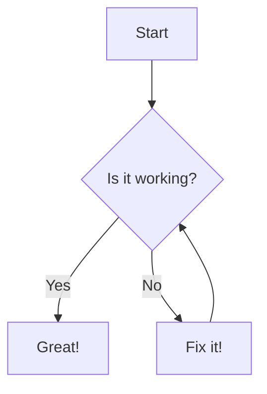
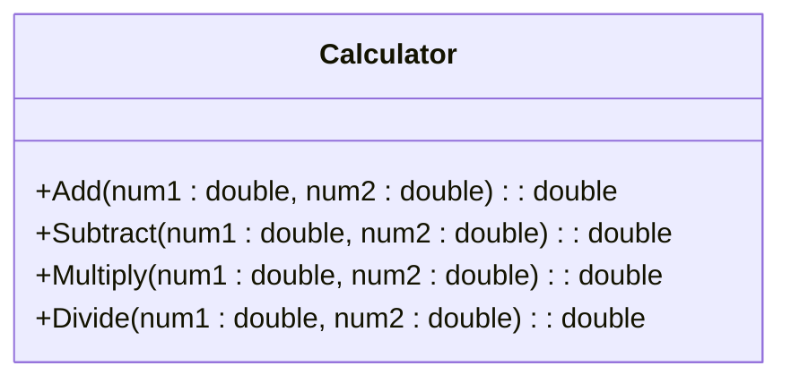

Okay, here is a comprehensive tutorial on using Obsidian for coding in C#, designed specifically for beginners.

**Obsidian for C# Coding: A Beginner's Guide**

**Introduction**

Obsidian is a powerful note-taking application based on Markdown files that offers a unique approach to knowledge management and organization. While it's not a traditional Integrated Development Environment (IDE) like Visual Studio, it can be a highly effective tool for planning, documenting, and even coding in C#. This guide will show you how.

**Why Use Obsidian for C#?**

*   **Structured Note-Taking:** Organize your coding projects, ideas, and research with interconnected notes.
*   **Code Snippets and Documentation:** Store reusable code, explanations, and links to external resources (like the official .NET documentation).
*   **Project Planning and Task Management:** Outline your project's architecture, break down tasks, and track progress using Markdown's simple syntax.
*   **Learning and Research:** Create a personal knowledge base about C# concepts, algorithms, and design patterns, making it easier to review and retain information.
*   **Flexibility and Control:** Obsidian's plain-text Markdown files give you full ownership and control over your data. Your notes are future-proof and can be accessed with any text editor.
*   **Extensibility with Plugins:** Enhance Obsidian's functionality with a vast library of community-built plugins that add features like Kanban boards, code highlighting, and more.

**Part 1: Setting Up Obsidian**

**1. Download and Install:**

*   Go to the official Obsidian website ([https://obsidian.md/](https://obsidian.md/)).
*   Download the installer for your operating system (Windows, macOS, or Linux).
*   Run the installer and follow the on-screen instructions.

**2. Create a Vault:**

*   Launch Obsidian.
*   Click "Create new vault."
*   Give your vault a name (e.g., "C# Projects").
*   Choose a location on your computer to store your vault (this is where all your notes will be saved).
*   Click "Create."

**3. Basic Obsidian Interface:**

*   **Left Sidebar:**
    *   **File Explorer:** Browse and manage the files and folders in your vault.
    *   **Search:** Find specific notes or keywords.
    *   **Starred:** Access frequently used notes.
    *   **Other options:** Plugins you install might add more options to the sidebar.
*   **Editor:** The main area where you write and edit your notes.
*   **Right Sidebar:**
    *   **Backlinks:** See which other notes link to the current note.
    *   **Outline:** View the headings in your current note (useful for navigation).
    *   **Other options:**  Plugins may add more options like tag management.

**Part 2: Markdown Essentials for C# Coding**

Markdown is a lightweight markup language that uses plain text formatting. Here are the basics you need for coding notes:

**1. Headings:**

```markdown
# Main Heading (Project Title)
## Subheading (Class Name)
### Sub-subheading (Method Name)
```

**2. Code Blocks:**

Use triple backticks (```) to create code blocks. Specify the language (csharp) for syntax highlighting:

````markdown
```csharp
public class MyClass
{
    public static void Main(string[] args)
    {
        Console.WriteLine("Hello, Obsidian!");
    }
}
```
````

**3. Inline Code:**

Use single backticks (\`) to highlight code within a sentence: `Console.WriteLine()`

**4. Lists:**

*   **Unordered Lists:**

```markdown
- Item 1
- Item 2
  - Subitem 1
```

*   **Ordered Lists:**

```markdown
1. First step
2. Second step
```

**5. Links:**

*   **External Links:**

```markdown
[Microsoft .NET Documentation](https://learn.microsoft.com/en-us/dotnet/)
```

*   **Internal Links (to other notes):**

```markdown
[[My CSharp Notes]]  
```

As you type `[[`, Obsidian will suggest notes from your vault.

**6. Bold and Italics:**

```markdown
**This text is bold.**
*This text is italic.*
```

**7. Tables:**

```markdown
| Class       | Method        | Description         |
|-------------|---------------|---------------------|
| `MyClass`   | `Main()`      | Entry point         |
| `Calculator`| `Add(int, int)` | Adds two integers |
```

**Part 3: Organizing Your C# Projects**

**1. Folder Structure:**

Create a logical folder structure within your vault to organize your projects. For example:

```
C# Projects/
├── Project A/
│   ├── Notes/
│   │   ├── Design.md
│   │   └── Algorithms.md
│   ├── Snippets/
│   │   └── DataStructures.md
│   └── ProjectA.md (main project overview)
└── Project B/
    ├── ...
```

**2. Project Overview Note:**

For each project, create a main project note (e.g., `ProjectA.md`). This note can include:

*   **Project Goal:** A brief description of what the project aims to achieve.
*   **Requirements:**  A list of features and functionalities.
*   **Architecture:** A high-level overview of the project's structure (classes, modules, etc.). You can use diagrams (created with plugins like Mermaid, explained later).
*   **Tasks:** A to-do list to break down the project into smaller, manageable steps.
*   **Links:** Links to other relevant notes within the project (e.g., design documents, code snippets).

**3. Class and Method Notes:**

Create separate notes for important classes and methods:

*   **Class Notes:** Document the purpose of the class, its properties, and its relationship to other classes. Include code examples of how to use the class.
*   **Method Notes:** Explain the method's algorithm, parameters, return value, and any potential edge cases.

**4. Snippets:**

Create a dedicated "Snippets" folder to store reusable code blocks. This can be organized by category (e.g., "Data Structures," "Algorithms," "File I/O").

**Part 4: Essential Plugins for C# Developers**

Obsidian's power comes from its plugin ecosystem. Here are some highly recommended plugins for C# development:

**1. Kanban:**

*   **Installation:** Go to Settings -> Community plugins -> Browse -> Search for "Kanban" -> Install -> Enable.
*   **Usage:** Create Kanban boards to visually manage your project's workflow. Use lanes like "To Do," "In Progress," "Testing," and "Done." Each card on the board can be a task or a feature linked to a more detailed note.

**Example:**

```markdown
# Project A Kanban

## To Do
- [ ] Design the user interface
- [ ] Implement data validation

## In Progress
- [ ] Write unit tests for `MyClass`

## Done
- [ ] Implemented core logic
```

**2. Dataview:**

*   **Installation:** (Same process as Kanban)
*   **Usage:** Dataview allows you to query your notes using a SQL-like syntax, making it easy to create dynamic tables and lists. This is powerful for summarizing project information, tracking tasks, and more.

**Example (list all incomplete tasks):**

````markdown
```dataview
TASK
FROM "Project A"
WHERE !completed
```
````

**3. Mermaid Diagrams:**

*   **Installation:** (Same process as Kanban)
*   **Usage:**  Create various types of diagrams (flowcharts, sequence diagrams, class diagrams) directly within your notes using the Mermaid syntax. This is excellent for visualizing your project's architecture.

**Example:**

````markdown

````

**4. Editor Syntax Highlight:**
*   **Installation:** (Same process as Kanban)
*   **Usage:** While Obsidian has basic code highlighting using backticks, this plugin allows for highlighting within the editor itself, increasing visibility.

**5. QuickAdd:**
*   **Installation:** (Same process as Kanban)
*   **Usage:** Allows users to quickly add information to their vault in a variety of ways. This plugin, used effectively, will greatly improve workflow efficiency.

**Part 5: A Sample C# Project Workflow in Obsidian**

Let's walk through a simple example of how you might manage a small C# project in Obsidian:

**Project: Console-Based Calculator**

**1. Create Project Folder and Note:**

*   In your "C# Projects" vault, create a folder called "Calculator."
*   Inside the "Calculator" folder, create a note named "Calculator.md."

**2. Project Overview (Calculator.md):**

```markdown
# Calculator Project

## Goal

Create a simple console-based calculator that can perform basic arithmetic operations (addition, subtraction, multiplication, division).

## Requirements

-   The calculator should prompt the user to enter two numbers.
-   The calculator should ask the user to choose an operation.
-   The calculator should display the result of the operation.
-   Handle potential errors (e.g., division by zero).

## Tasks

-   [ ] Create a `Calculator` class
-   [ ] Implement `Add`, `Subtract`, `Multiply`, and `Divide` methods
-   [ ] Write a `Main` method to handle user input and output
-   [ ] Add error handling

## Design

[See [[Calculator Design]] note]

## Snippets
- [[Input Validation Snippet]]
```

**3. Design Note (Calculator Design.md):**

```markdown
# Calculator Design

## Class Diagram



## Notes

- The `Calculator` class will contain static methods for each operation.
- Input validation will be performed before calculations.
```

**4. Kanban Board (Calculator.md or a separate note):**

```markdown
# Calculator Kanban

## To Do
- [ ] Create a `Calculator` class

## In Progress
- [ ] Implement `Add` method

## Done
- [ ] Set up project structure in Obsidian
```

**5. Code Snippets (Input Validation Snippet.md):**

```markdown
# Input Validation Snippet

```csharp
public static double GetDoubleInput(string prompt)
{
    double number;
    while (true)
    {
        Console.Write(prompt);
        if (double.TryParse(Console.ReadLine(), out number))
        {
            return number;
        }
        Console.WriteLine("Invalid input. Please enter a valid number.");
    }
}
```
```

**6. Using the Code (not within Obsidian):**

*   You'll still need a proper C# IDE (like Visual Studio or VS Code with the C# extension) to write, compile, and run your actual C# code.
*   Copy code snippets from Obsidian into your IDE.
*   Use your Obsidian notes as a reference for the project structure, design, and logic.

**Part 6: Tips for Effective Coding with Obsidian**

*   **Link Liberally:** Create connections between notes to build a web of knowledge. Link project overviews to design documents, class notes to method notes, and code snippets to the parts of your project where they are used.
*   **Use Tags:** Add tags to your notes (e.g., `#CSharp`, `#Algorithm`, `#DataStructure`, `#ProjectA`) to make them easier to categorize and search. The Tags pane in the right sidebar can help with this.
*   **Review and Refactor Notes:** As your project evolves, regularly review and update your notes to reflect the current state of the code.
*   **Templates:** Create note templates for common elements (e.g., class templates, method templates) to speed up your note-taking process. The Templater plugin can help.
*   **Version Control (Optional):** Consider using a version control system like Git to track changes to your Obsidian vault, especially for larger projects. You can use the Obsidian Git plugin to manage this from within Obsidian.
*   **Daily Notes:** Use the Daily Notes feature (or plugin) to keep a journal of your coding progress, challenges faced, and solutions found.
*   **Don't Be Afraid to Experiment:** Obsidian is highly customizable. Try out different plugins, workflows, and organization methods to find what works best for you.

**Conclusion**

Obsidian, combined with a traditional C# IDE, can be a powerful combination for managing your coding projects, learning C#, and building a robust personal knowledge base. By leveraging Markdown, plugins, and a well-organized vault, you can enhance your productivity, improve your understanding of C# concepts, and create a valuable resource that you can refer back to throughout your coding journey. Remember that the key is to find a workflow that suits your individual needs and preferences, so don't hesitate to adapt and refine the techniques presented in this guide.
